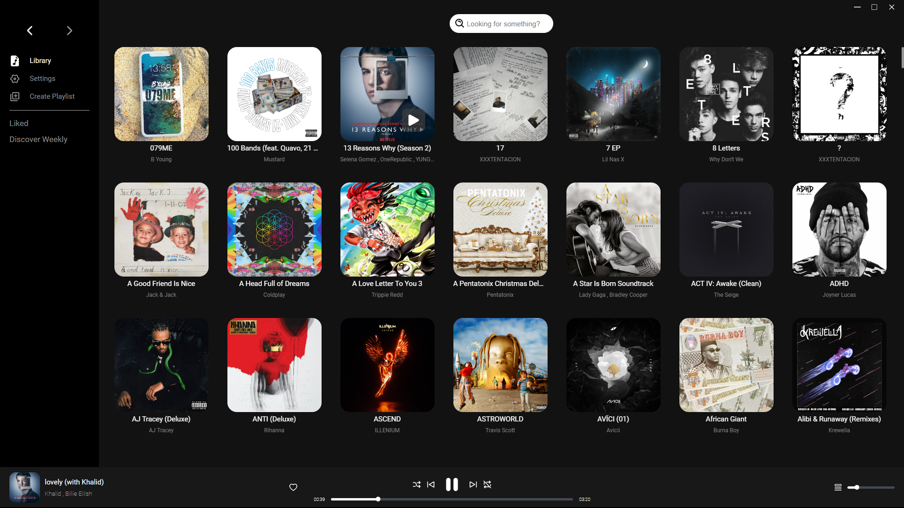
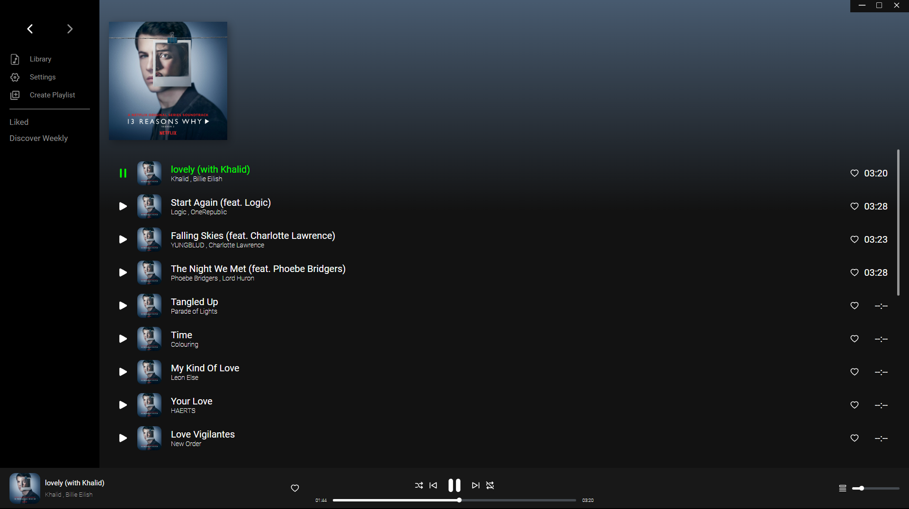

# Music App

## Why ?

Was bored and wanted to try making one

## How ?

- Electron for cross-platform development
- React for front-end
- youtubedl for track streaming
- Spotify for metadata
- Sqlite3 to store library data

## Progress

- [x] Spotify Importer
- [x] Youtube source
- [ ] CI/CD
- [ ] Decide on shuffle and queue algoritm
- [ ] Local tracks importer
- [ ] Spotify search
- [ ] Track download
- [ ] Ability to rename playlists
- [ ] Ability to change playlist covers

## Run

```
npm install
npm run start
```

## Build

```
npm install
npm run package
```

## Samples



